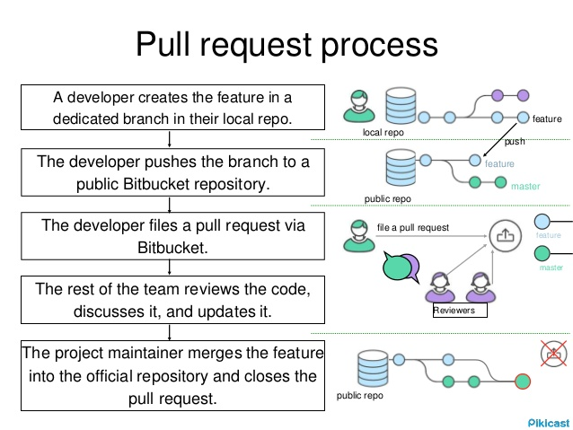

## Overview

- What is version control
    - Keep track of changes
    - Commit updates
    - Allows you to go back and undo/edit previous changes
- git is Decentralized (explains some of its quirks)
    - No real concept of master (instead one or more remotes)
    - Always have a full copy locally on your computer

## Remotes

You can add remotes for your project

- You could add one per coworker
- Generally you set up one
    - You can choose any name, but origin is "default"
- None: R projects can be kept locally, but still have version control

```
git remote add <name> <url>
```

When cloning github repo, it is automatically added as a remote with the name: origin

## Branches

- master
- feature branch 
    - Here you do your current work
    - Is local unless you associate it with an upstream

``` 
# Create a new branch
git branch [branch-name]
# Switch to the new branch
git checkout [branch-name]
```

## Tutorial

- Run through: try.github.io/levels/1/challenges/1
- Cheatsheet
- Proxy settings (stack)

```
git config --global https.proxy https://158.119.147.68:3128
git config --global http.proxy http://158.119.147.68:3128
```

## Working together

- The "github" way
- Forking (your own copy)
- Pull requests

### Shared repo

- Still often chose to use PRs

## Pull requests



## Tutorial/Live demo

- Fork Blackedder/git-devtools-rcpp-presentations
- Clone to local machine

```
git clone https://github.com/BlackEdder/git-devtools-rcpp-presentations.git
```

- Create feature branch

```
git branch improvements
git checkout improvements
```

- Make your changes
- Push feature branch
- Open pull request

I can demo this part without the forking step

## Other resources

https://www.codeschool.com/learn/git (4th, seems to be free)
https://campus.codeschool.com/courses/mastering-github/level/1/section/1/video/1
https://services.github.com/kit/downloads/github-git-cheat-sheet.pdf
https://git-scm.com/book/en/v2
